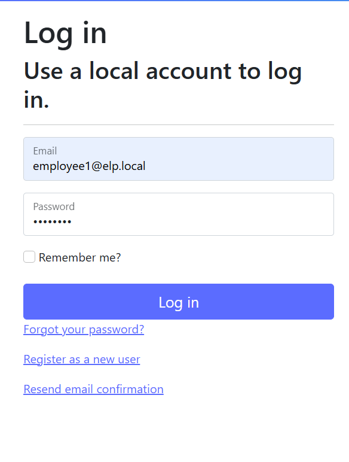
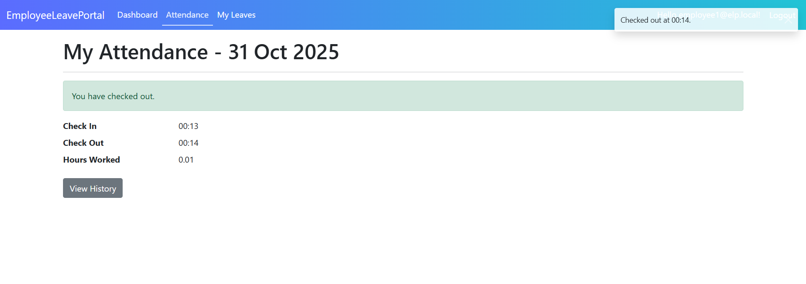
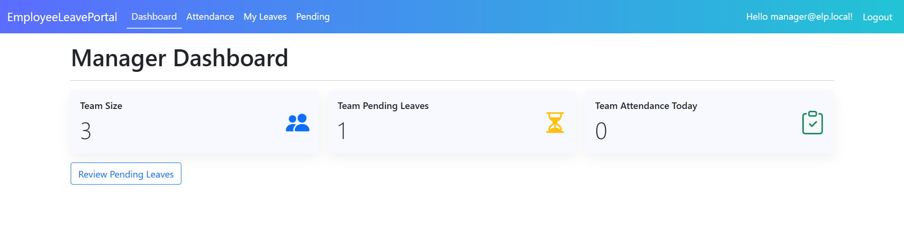
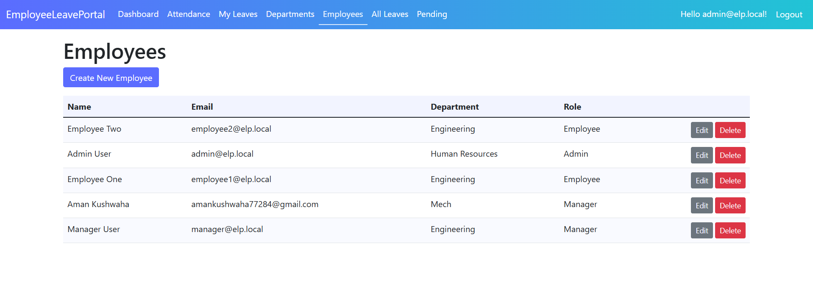
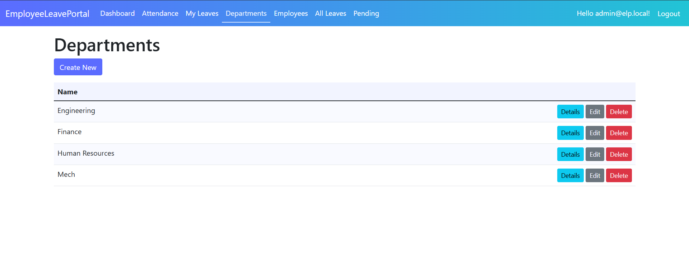
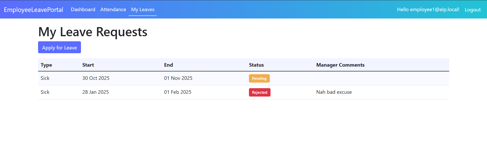
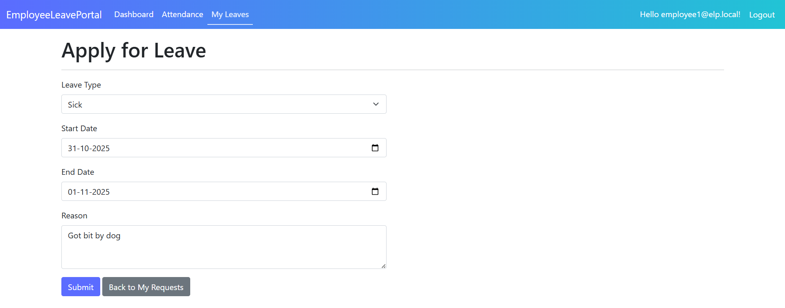
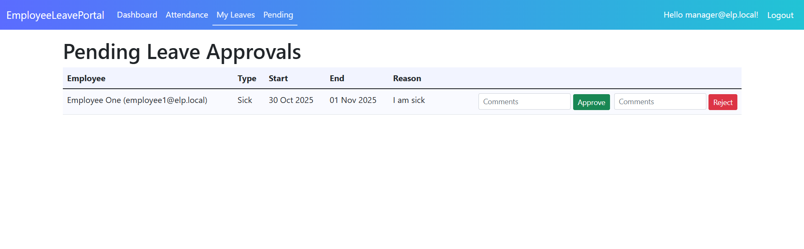

# Employee Leave Portal (ASP.NET Core MVC)

A simple Employee Leave Portal built with ASP.NET Core 8 MVC, MySQL, and Entity Framework Core. Includes authentication with roles (Admin, Manager, Employee), CRUD for Departments and Employees, Attendance (check-in/out + hours), Leave Requests (apply/approve/reject), dashboards, and a clean Bootstrap-based UI.

## Features
- Authentication and roles: Admin, Manager, Employee
- Departments: Admin CRUD
- Employees: Admin CRUD with department + role assignment
- Attendance: check-in/out, auto hours calculation, history
- Leaves: apply with overlap prevention, Manager approve/reject, Admin view all
- Dashboards: Admin/Manager/Employee summaries
- UI: role-based navbar, colorful theme, badges, date/time formatting, toasts + confirms

## Prerequisites
- .NET 8 SDK
- MySQL 8.x server (local or remote)
- Optional: EF Core CLI (`dotnet tool install --global dotnet-ef`)

## Installation / Setup
1. Clone the repository
   - `git clone https://github.com/amankushwahacodes/Employee-leave-portal.git`
   - `cd Employee-leave-portal`
2. Configure the database connection
   - Open `appsettings.json` and set `ConnectionStrings:DefaultConnection` to your MySQL instance.
   - Example: `Server=localhost;Port=3306;Database=EmployeeLeavePortalDb;User=root;Password=<your_password>`
3. Create/update the database schema
   - If you have dotnet-ef installed: `dotnet ef database update`
   - Or simply run the app once; it will apply migrations on start in Development.

## How to Run
- Development (recommended for hot reload)
  - `dotnet watch run --urls http://localhost:5296`
- Standard run
  - `dotnet run --urls http://localhost:5296`
- Open the app at: `http://localhost:5296`

## Seeded Users (for demo)
- Admin: `admin@elp.local` / `Pass@123`
- Manager: `manager@elp.local` / `Pass@123`
- Employee: `employee1@elp.local` / `Pass@123`
- Employee: `employee2@elp.local` / `Pass@123`

Notes:
- On first run, the app seeds roles, departments (HR, Engineering, Finance), and demo users.
- Dashboard is the default route; navbar shows links based on role.

## Tech Stack
- ASP.NET Core 8 MVC, Razor Views
- Entity Framework Core + Pomelo MySQL provider
- ASP.NET Core Identity (custom `ApplicationUser`)
- Bootstrap 5, Bootstrap Icons

## Troubleshooting
- Port already in use / file lock on Windows: stop any running `EmployeeLeavePortal.exe` before rebuilding.
- MySQL key length errors: handled by explicit Identity key length configuration.
- View changes not updating: hot reload is enabled; if needed, restart or use `dotnet watch run`.

## License
This project is for educational/demo purposes.

## Screenshots

